# Denoising Step Ablation Experiment

Pi0.5 generates robot actions via flow matching with **10 Euler denoising steps**. Each step requires a full forward pass through the action expert, making inference expensive. This experiment investigates whether all 10 steps are necessary.

**Result: 1-step denoising matches 10-step (74.67% vs 74.96%), enabling a potential 10x inference speedup.**

## Experiments

### Exp 1: Denoising Trajectory Geometry (`exp1_denoising.py`)

Analyzes the shape of flow matching trajectories from noise to actions across 675 episodes (45 ML45 tasks).

| Figure | Description | Key Finding |
|--------|-------------|-------------|
| 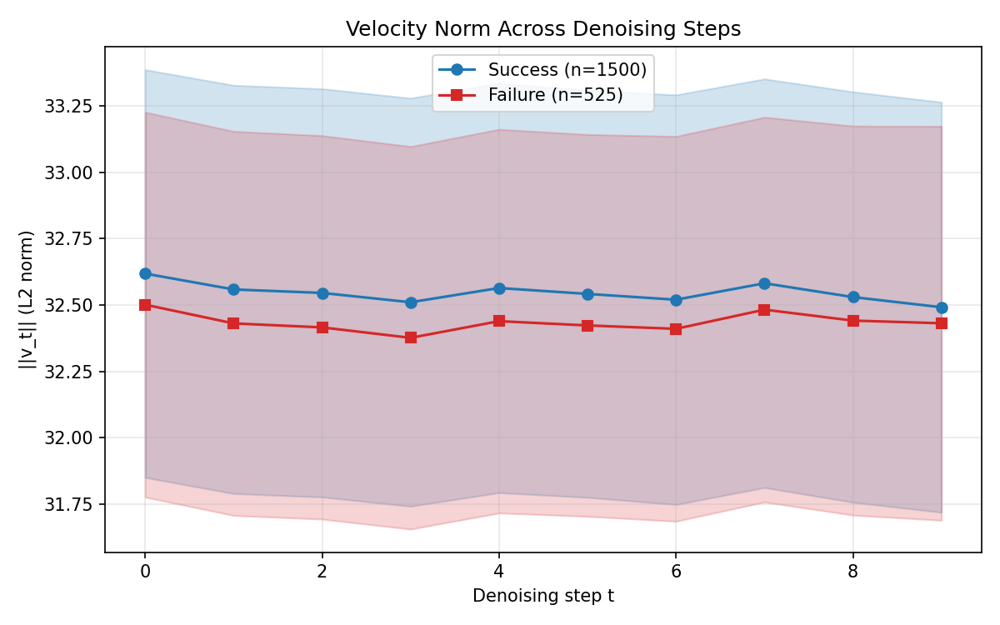 | Velocity norm across steps | Flat (~32.5) at every step -- constant speed, no deceleration |
| 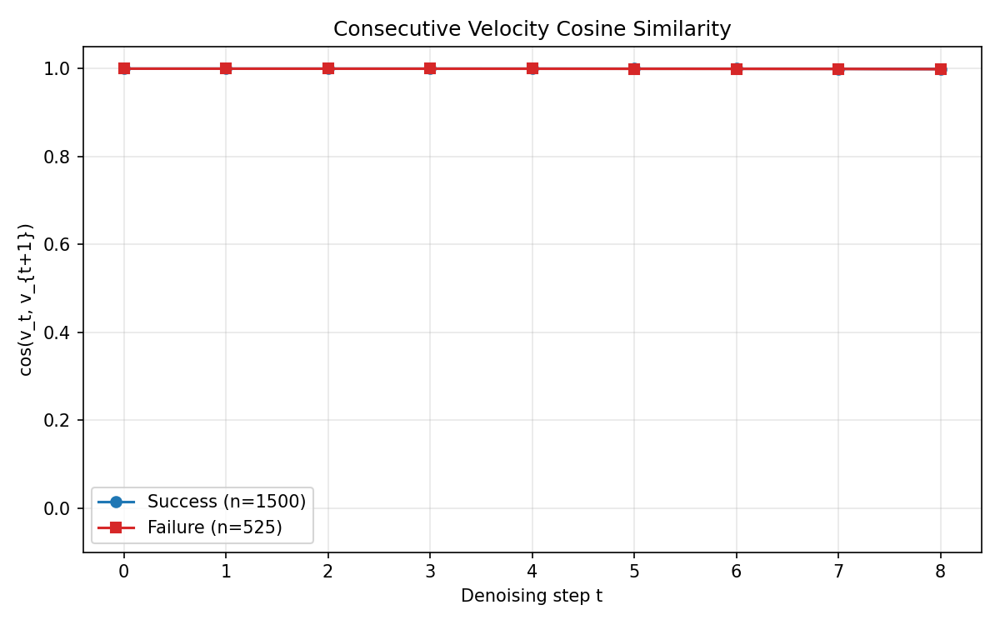 | Cosine similarity between consecutive velocities | 0.9999 everywhere -- direction never changes |
| 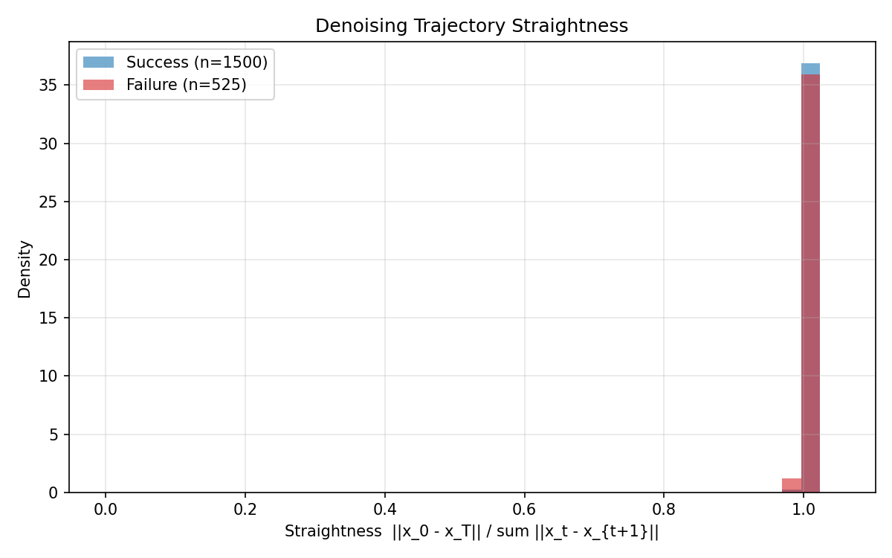 | Chord/arc ratio distribution | Mean 0.9998, median 1.0 -- perfect straight lines |
| 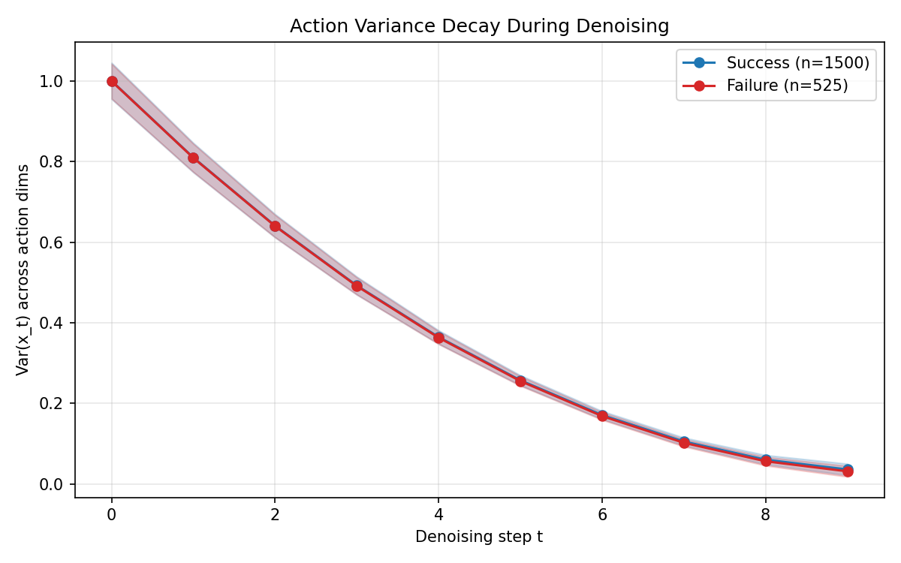 | Variance decay across steps | Smooth decay from ~1.0 to ~0.03 along straight path |

**Implication:** Euler integration is exact for straight lines regardless of step count.

### Exp 2: adaRMS Conditioning (`exp2_adarms.py`)

Checks whether the timestep conditioning that modulates the action expert varies with the input observation.

| Figure | Description | Key Finding |
|--------|-------------|-------------|
| 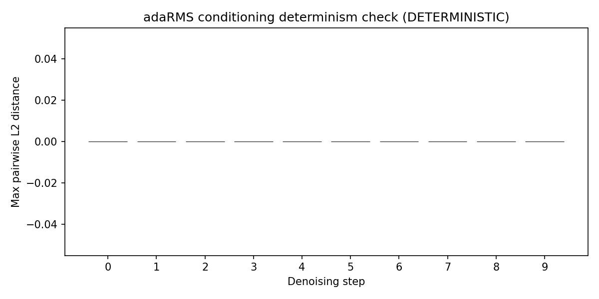 | Max L2 distance across episodes per step | 0.0 at every step -- 100% deterministic |
| 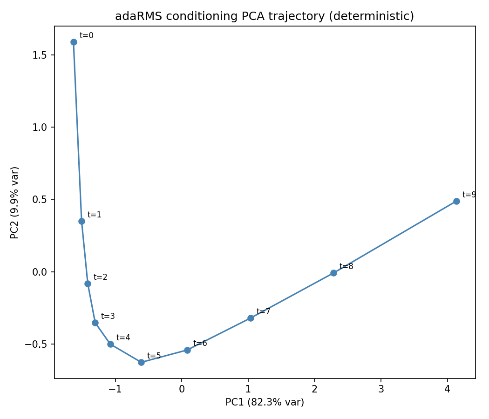 | Conditioning trajectory in PCA space | Smooth curve, PC1 captures 82.3% of variance |
| 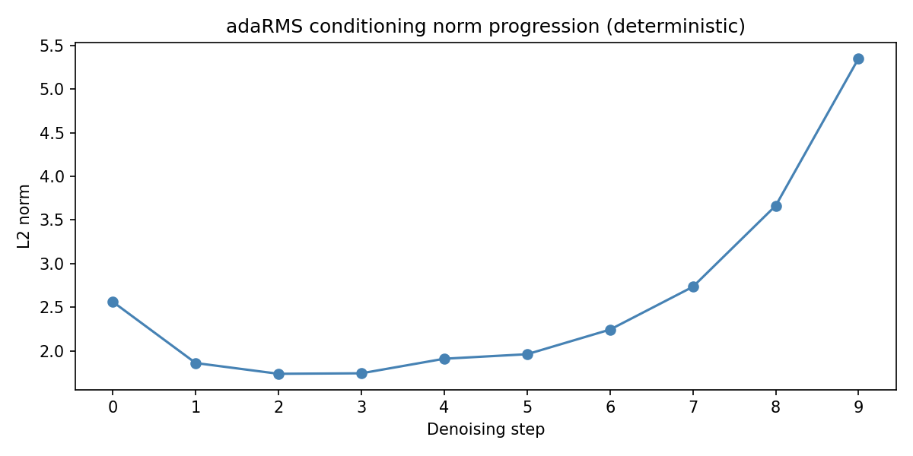 | Conditioning norm across steps | Range [1.7, 5.4], increases at later steps |
| 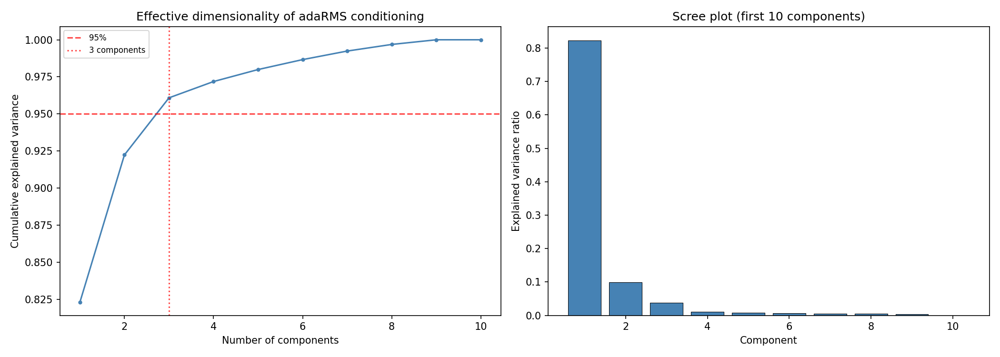 | Cumulative variance explained | Only 3 components for 95% variance |

**Implication:** adaRMS conditioning is a fixed lookup table per timestep -- no observation-dependent iterative refinement.

### Exp 3: Cross-Denoising CKA (`exp3_denoising_cka.py`)

Measures whether internal representations of the action expert change across denoising steps using linear CKA on suffix residual activations (layers 0, 5, 11, 17).

| Figure | Description | Key Finding |
|--------|-------------|-------------|
| 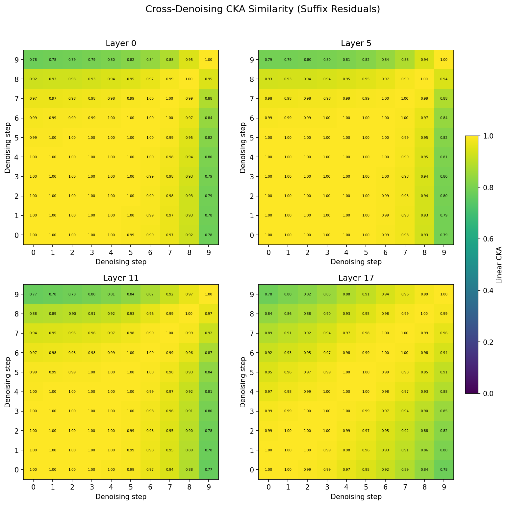 | 10x10 CKA heatmaps per layer | Uniformly high (>0.77, mean ~0.95) |
| 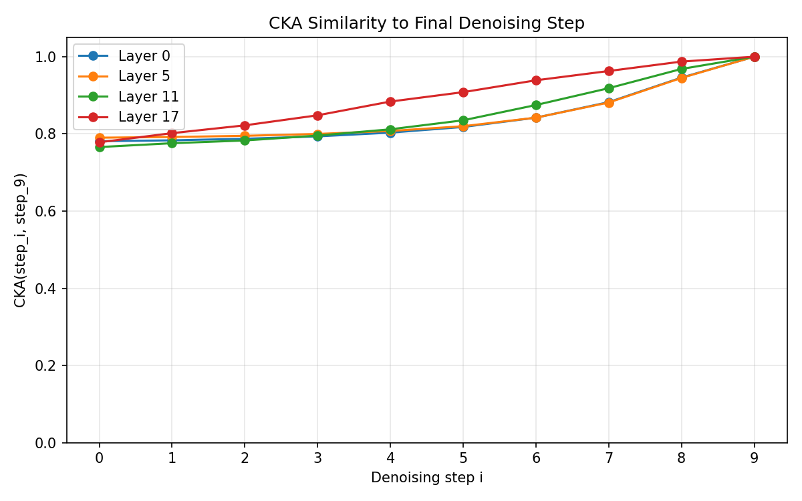 | CKA to final step vs denoising step | Starts at 0.78, increases monotonically |

**Implication:** The network computes essentially the same thing at every denoising step.

### Exp 4: Behavioral Ablation (`exp4_denoising_steps.py`)

Based on the mechanistic evidence above, evaluates actual task success rate with 1, 2, 3, 5, and 10 denoising steps across all 45 ML45 training tasks (15 envs per task).

| Steps | Mean Success Rate |
|------:|------------------:|
| **1** | **74.67%** |
| 2 | 73.33% |
| 3 | 73.04% |
| 5 | 72.74% |
| **10** | **74.96%** |

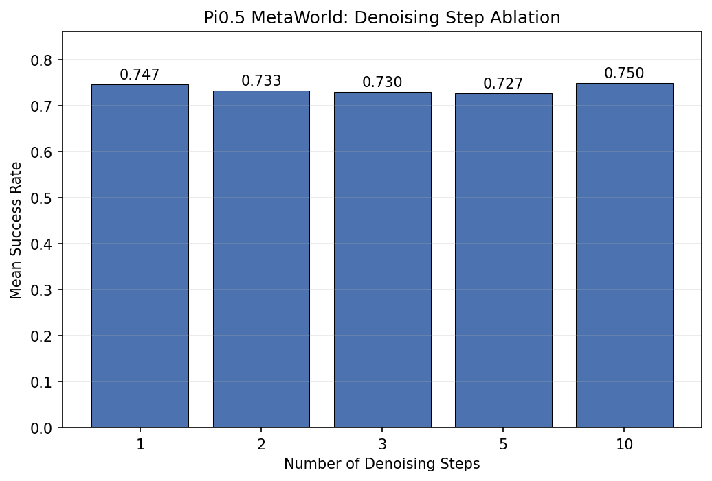

## File Structure

```
denoising_step_exp/
├── README.md                   # This file
├── data_utils.py               # Shared activation data loader
├── exp1_denoising.py           # Trajectory geometry analysis (4 figures)
├── exp2_adarms.py              # adaRMS conditioning analysis (4 figures)
├── exp3_denoising_cka.py       # Cross-denoising CKA analysis (2 figures)
├── exp4_denoising_steps.py     # Ablation results analysis (2 figures)
├── eval_denoising_steps.py     # In-process eval with configurable --num_steps
├── run_denoising_ablation.sh   # Runner for all step counts
└── results/
    ├── ablation/               # Raw JSON results per step count
    └── figures/
        ├── exp1/               # 4 trajectory geometry figures
        ├── exp2/               # 4 adaRMS conditioning figures
        ├── exp3/               # 2 CKA heatmap figures
        └── exp4/               # Ablation bar chart + heatmap
```

## Reproducing

All commands run from the repo root.

### Mechanistic analysis (no GPU, reads pre-collected activations)

Requires activation data at `ml45-activations-15/5000/`.

```bash
uv run denoising_step_exp/exp1_denoising.py
uv run denoising_step_exp/exp2_adarms.py
uv run denoising_step_exp/exp3_denoising_cka.py
```

### Behavioral ablation (1 GPU, ~5 hours)

```bash
export CUDA_VISIBLE_DEVICES=1
bash denoising_step_exp/run_denoising_ablation.sh
```

### Analyze ablation results

```bash
uv run denoising_step_exp/exp4_denoising_steps.py
```

### Tests

```bash
uv run pytest tests/test_denoising_steps.py -v
```
