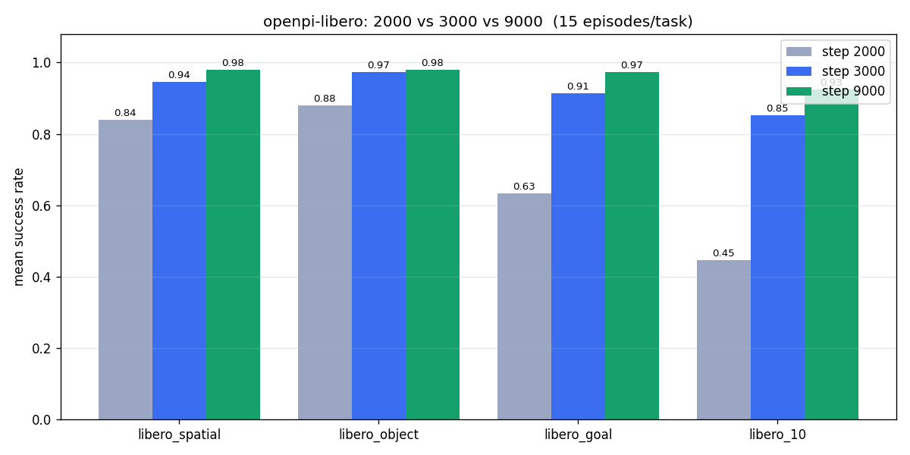
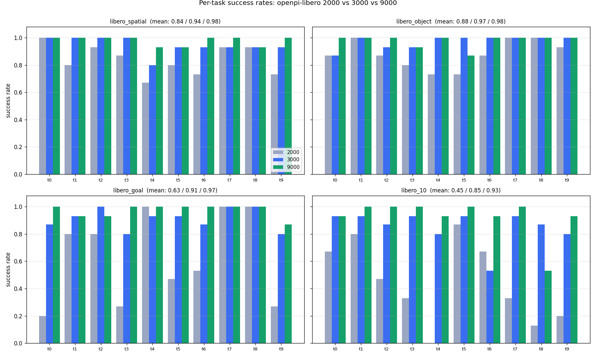

# LIBERO Client Example

LIBERO needs its own Python 3.8 environment, so this example follows the same separate-client pattern as `examples/robocasa_env`: the simulation runs in `examples/libero_env`, the policy server stays in the main repo environment, and the two talk over WebSocket.

Unlike the old `examples/libero` setup, this version is organized like the newer env examples:
- `main.py` evaluates one LIBERO task.
- `eval_all.py` evaluates every task in one LIBERO suite, launching one subprocess per task_id for parallel execution.

## Installation

Initialize submodules first if you have not already:

```bash
git submodule update --init --recursive
```

Then sync the dedicated environment and write LIBERO's default config for this checkout:

```bash
cd examples/libero_env
uv sync
uv run python setup_libero_config.py
```

`~/.libero/config.yaml` is LIBERO's default config file. It tells LIBERO where to find the benchmark, assets, init states, and datasets. Rerun `setup_libero_config.py` if this checkout moves.

If EGL gives you MuJoCo rendering issues, rerun the client commands below with `MUJOCO_GL=glx` instead of `MUJOCO_GL=egl`.

## Training

Compute normalization stats once before the first training run, then launch training. Both commands run from the repo root:
```bash
uv run scripts/compute_norm_stats.py --config-name pi05_libero

XLA_PYTHON_CLIENT_MEM_FRACTION=0.9 uv run scripts/train.py pi05_libero \
    --exp-name pi05_libero_test \
    --overwrite \
    --num_train_steps 30_000
```

The `pi05_libero` config is registered in `src/openpi/training/config.py`.

We have released checkpoints trained with the following config:
```python
TrainConfig(
    name="pi05_libero",
    model=pi0_config.Pi0Config(pi05=True, action_horizon=10, discrete_state_input=False),
    data=LeRobotLiberoDataConfig(
        repo_id="physical-intelligence/libero",
        base_config=DataConfig(prompt_from_task=True),
        extra_delta_transform=False,
    ),
    batch_size=256,
    fsdp_devices=4,
    lr_schedule=_optimizer.CosineDecaySchedule(
        warmup_steps=10_000,
        peak_lr=5e-5,
        decay_steps=1_000_000,
        decay_lr=5e-5,
    ),
    optimizer=_optimizer.AdamW(clip_gradient_norm=1.0),
    ema_decay=0.999,
    weight_loader=weight_loaders.CheckpointWeightLoader("gs://openpi-assets/checkpoints/pi05_base/params"),
    num_train_steps=30_000,
)
```

- [`brandonyang/openpi-libero-2000`](https://huggingface.co/brandonyang/openpi-libero-2000)
- [`brandonyang/openpi-libero-3000`](https://huggingface.co/brandonyang/openpi-libero-3000)
- [`brandonyang/openpi-libero-9000`](https://huggingface.co/brandonyang/openpi-libero-9000)

## Evaluation

### Serving the LIBERO Policy

Start the policy server from the repo root in a separate terminal:

```bash
uv run scripts/serve_policy.py --env LIBERO
```

To serve a specific checkpoint instead of the default one:

```bash
uv run scripts/serve_policy.py policy:checkpoint \
  --policy.config=pi05_libero \
  --policy.dir=path/to/checkpoint
```

### Run Evaluation

#### Single task

```bash
cd examples/libero_env
MUJOCO_GL=egl uv run python main.py --task_suite_name libero_spatial --task_id 0
```

#### Full suite

`eval_all.py` runs every task in one LIBERO suite by launching one `main.py` subprocess per task_id. Each subprocess has its own MuJoCo/EGL context (the thing that prevents in-process parallelism), so tasks can run concurrently without stepping on each other.

```bash
cd examples/libero_env
MUJOCO_GL=egl uv run python eval_all.py --task_suite_name libero_spatial

# With more episodes per task and a concurrency cap:
MUJOCO_GL=egl uv run python eval_all.py \
    --task_suite_name libero_10 --num_episodes 15 --num_workers 5

# For sequential execution (with inline stack traces on crash):
MUJOCO_GL=egl uv run python eval_all.py --task_suite_name libero_spatial --num_workers 1
```

A full run produces a single directory containing everything:
```
examples/libero_env/output/<task_suite_name>/
├── results.json                             # aggregated, incrementally saved
├── parallel_logs/task_NN.log                # per-subprocess stdout + stderr
└── <task_id:02d>-<task_name>/episode_NNN.mp4
```

#### Evaluation Results with Released Checkpoints




## Activation Collection

### Downloading Pre-Collected Activations

```bash
hf download brandonyang/pi05-libero-activations-v1-2000-15env --repo-type dataset --local-dir pi05_libero_activations-v1-2000-15env
```

For mech-interp work you can have the policy server save per-step intermediate
activations to disk while a libero rollout runs. This uses a separate
"collection-mode" policy server that wraps the policy in `CollectingPolicy`
and writes the same on-disk format as `examples/metaworld/main.py --collect`
(metaworld's in-process collector). Activations live entirely on the **server's**
filesystem — the libero client never touches them, so the client and server
can be on different machines.

Start the collection-mode server from the repo root in one terminal:

```bash
# Terminal 1 (main openpi venv) — server pinned to GPU 0
export CUDA_VISIBLE_DEVICES=0
uv run scripts/serve_policy.py --pytorch --collect_activations \
    --output-dir ./activations \
    policy:checkpoint --policy.config=pi05_libero \
    --policy.dir=/path/to/checkpoint
```

Then run a libero rollout with `--collect` from this directory:

```bash
# Terminal 2 (libero_env venv)
cd examples/libero_env
# Full suite in parallel (each subprocess has a distinct task_name → distinct output dir on the server):
MUJOCO_GL=egl uv run python eval_all.py --task_suite_name libero_spatial --collect --num_workers 5

# or for a single task:
MUJOCO_GL=egl uv run python main.py --task_suite_name libero_spatial --task_id 0 --collect
```

Notes:
- Collection mode requires `--pytorch` on the server. `infer_with_intermediates`
  is implemented for the PyTorch backend only.
- A collection-mode server **rejects** plain inference requests. If you want to
  also run regular eval, start a separate non-collection server on a different
  port.
- The server's `--output-dir` is on the **server's** filesystem. With
  `--output-dir ./activations`, files land at
  `./activations/pi05_libero/<task_name>/episode_NNN_env_000/step_NNNN/`
  relative to wherever the server was launched from.
- `eval_all.py --collect` defaults to 2 episodes per task. Override with
  `--num_episodes N`. Each episode uses the next deterministic initial state
  from LIBERO's task suite, so reproducibility is built-in.

### Protocol: what `--collect_activations` server expects

The collection-mode server is **collection-only**: every WebSocket request
must include either `__collect__` or `__finalize_episode__` (but not both)
inside the obs dict, or the server raises a `ValueError` and closes the
connection. The same server can be reused by any client (libero, robocasa,
real robot, custom env) as long as the client speaks this protocol. The
libero `CollectionSession` helper at `examples/libero_env/collection_session.py`
is one reference implementation; below is the wire-level spec so you can
write your own.

The WebSocket transport itself is unchanged — same `msgpack_numpy`
serialization, same `policy.infer(obs_dict)` shape. The "magic keys" are
just additional fields the wrapper pops off before dispatching.

#### Per-step inference call: `__collect__`

Send a normal inference observation dict, plus a `__collect__` field
containing per-step bookkeeping. The server runs
`policy.infer_with_intermediates(obs)`, slices `env_id` from the batch
dim of each intermediate, writes the activations + per-step
`metadata.json` to disk, and returns the actions exactly like a normal
infer call.

```python
{
    # --- normal inference fields (single example, batch dim added by server) ---
    "observation/image":       <H, W, 3 uint8>,         # base camera
    "observation/wrist_image": <H, W, 3 uint8>,         # wrist camera
    "observation/state":       <state_dim float32>,     # 1-D state
    "prompt":                  "<task description>",     # str

    # --- collection metadata (required) ---
    "__collect__": {
        "task_name":                   "pick_up_the_alphabet_soup_...",  # str
        "episode_id":                  0,                                 # int
        "env_id":                      0,                                 # int (always 0 for libero)
        "step":                        47,                                # int (rollout step counter)
        "inference_step":              8,                                 # int (inference call counter, monotonically increasing)
        "prompt":                      "<task description>",              # str (duplicated for the saved metadata.json)
        "cumulative_reward":           0.0,                               # float (sum of rewards so far)
        "success_so_far":              false,                             # bool
        "reward_since_last_inference": 0.0,                               # float (delta since previous __collect__ call)
    },
}
```

The server writes activations to:
```
<output_dir>/<checkpoint_step>/<task_name>/episode_<episode_id:03d>_env_<env_id:03d>/step_<step:04d>/
    denoising.npz       # all_x_t, all_v_t
    adarms_cond.npz     # all_adarms_cond
    suffix_residual.npz # all_suffix_residual
    suffix_mlp_hidden.npz # all_suffix_mlp_hidden
    metadata.json       # the __collect__ dict, verbatim
```

Where:
- `<output_dir>` is the server's `--output-dir` flag (resolved to absolute at startup).
- `<checkpoint_step>` is `pathlib.Path(args.policy.dir).name` — for `pi05_libero` this resolves to `pi05_libero`.

Server response is the standard infer dict:
```python
{"actions": <action_horizon, action_dim float32>, "policy_timing": {...}}
```

**`task_name` validation:** the server rejects task names that contain path
traversal (`..`), absolute paths (`/tmp/foo`), nested paths (`a/b`), or
backslashes (`a\b`). This prevents a malicious or buggy client from
writing outside `<output_dir>`. See `_sanitize_task_name` in
`src/openpi/serving/activation_collector.py`.

#### Per-episode finalization call: `__finalize_episode__`

After the rollout loop ends (success, max-steps, or exception), send a
**separate** call with only the `__finalize_episode__` field. This is not
a real inference — the server skips the model entirely, writes
`metadata.json` and `rewards.npz` for the episode, and returns an ack.

```python
{
    "__finalize_episode__": {
        "task_name":             "...",                    # str (must match the per-step calls)
        "episode_id":            0,                        # int
        "env_id":                0,                        # int
        "prompt":                "...",                    # str
        "episode_success":       true,                     # bool
        "total_reward":          1.0,                      # float
        "steps_to_success":      152,                      # int (rewards-array index of first done; -1 if never)
        "total_env_steps":       153,                      # int (= len(per_step_reward))
        "total_inference_steps": 28,                       # int (= number of __collect__ calls in this episode)
        "per_step_reward":       [0.0, 0.0, ..., 1.0],     # list[float], length total_env_steps
        "per_step_success":      [false, ..., true],       # list[bool], length total_env_steps
    },
}
```

The server writes:
```
<output_dir>/<checkpoint_step>/<task_name>/episode_<episode_id:03d>_env_<env_id:03d>/
    metadata.json   # the finalize dict + checkpoint_dir + config_name (server adds these from its startup args)
    rewards.npz     # per_step_reward, cumulative_reward (cumsum), success_at_step
```

Server response:
```python
{"ack": True, "episode_dir": "<absolute path to episode_dir>"}
```

The client should not block waiting for the ack to come back as actions —
this call returns no `actions` key.

#### Error responses

- **Neither magic key present** → server raises
  `ValueError("Collection-only server requires either __collect__ or __finalize_episode__ to be set on every request.")`
  The WebSocket layer catches the exception, sends the traceback as a
  string frame, and closes the connection with `INTERNAL_ERROR`.
- **Both magic keys present in one call** → server raises
  `ValueError("Request contains both __collect__ and __finalize_episode__; only one is allowed per call.")`
- **Invalid `task_name`** (path traversal etc.) → server raises
  `ValueError("Invalid task_name {!r}: ...")`.

In all error cases the client sees the traceback as a string from
`websocket.recv()` instead of a dict; the `WebsocketClientPolicy.infer`
method already handles this by raising `RuntimeError` with the server
traceback inlined.

#### State the server tracks vs. what the client must track

The collection server is **stateless** between requests — it does not
remember which task is in progress, what the current `inference_step`
is, or which rewards have been seen so far. All of that bookkeeping
lives on the **client** side (see `CollectionSession` for the libero
reference implementation). The server only knows:
- `output_root` (from `--output-dir`)
- `checkpoint_step`, `policy_dir`, `config_name` (from `--policy.config` / `--policy.dir`)

Everything else comes in on each request via the magic keys. This means
two separate clients can talk to one collection server simultaneously
without the server confusing their episodes — as long as their
`(task_name, episode_id, env_id, step)` tuples don't collide.

#### Server metadata (returned on connect)

The collection server publishes its config in the WebSocket greeting
metadata, so clients can discover the checkpoint identity:

```python
{
    "policy_dir":      "/home/.../checkpoints/pi05_libero",
    "config_name":     "pi05_libero",
    "collection_mode": "v1",
    "checkpoint_step": "pi05_libero",
    "output_root":     "/abs/path/to/activations",
}
```

Read it via `client.get_server_metadata()` immediately after constructing
the `WebsocketClientPolicy` (the libero client logs it on startup).
