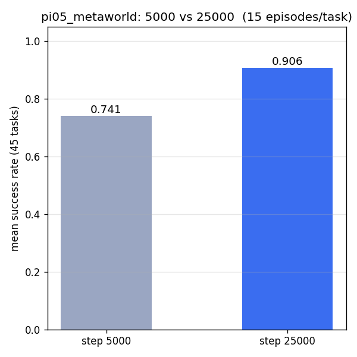
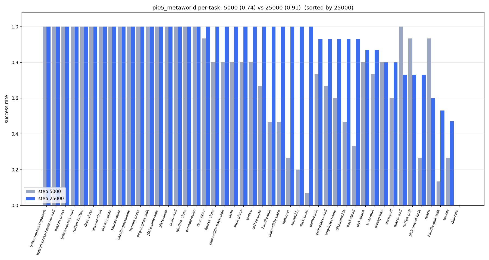

# MetaWorld Example

[MetaWorld](https://meta-world.github.io/) is a benchmark of 50 simulated robotic manipulation tasks built on MuJoCo. This directory contains every metaworld-specific entry point: the dataset generator (`generate_dataset.py`) and the eval clients (`main.py`, `eval_all.py` — both support an optional `--collect` flag for in-process activation collection).

## Installation

No separate venv is required.

## Generating the Dataset for Training

`generate_dataset.py` rolls out [MetaWorld's scripted policies](https://github.com/Farama-Foundation/Metaworld) (`metaworld.policies.ENV_POLICY_MAP`) across all ML45 train tasks, records per-step observations and three camera views, and pushes the result to the HuggingFace Hub as a LeRobot dataset.

```bash
MUJOCO_GL=egl uv run examples/metaworld/generate_dataset.py \
    --repo_id <hf-username>/metaworld_ml45 \
    --num_envs 50 \
    --num_episodes 2
```

You must be authenticated with `hf auth login` before running, since the script ends with `dataset.push_to_hub()`.

We have pre-generated the ML45 dataset with ~100 demonstrations per task at [`brandonyang/metaworld_ml45`](https://huggingface.co/datasets/brandonyang/metaworld_ml45).

## Training

Compute normalization stats once before the first training run, then launch training. Both commands run from the repo root:

```bash
uv run scripts/compute_norm_stats.py --config-name pi05_metaworld

XLA_PYTHON_CLIENT_MEM_FRACTION=0.9 uv run scripts/train.py pi05_metaworld \
    --exp-name pi05_metaworld_test \
    --overwrite \
    --num_train_steps 30_000
```

The `pi05_metaworld` config is registered in `src/openpi/training/config.py`.

We have released two checkpoints trained with the following config:
```python
TrainConfig(
    name="pi05_metaworld",
    model=pi0_config.Pi0Config(pi05=True, action_horizon=32, discrete_state_input=False),
    data=LeRobotMetaworldDataConfig(
        repo_id="brandonyang/metaworld_ml45",
        base_config=DataConfig(prompt_from_task=True),
        extra_delta_transform=False,
    ),
    batch_size=128,  # 256,
    lr_schedule=_optimizer.CosineDecaySchedule(
        warmup_steps=1_000,
        peak_lr=5e-5,
        decay_steps=29_000,
        decay_lr=5e-6,
    ),
    optimizer=_optimizer.AdamW(clip_gradient_norm=1.0),
    ema_decay=0.999,
    weight_loader=weight_loaders.CheckpointWeightLoader("gs://openpi-assets/checkpoints/pi05_base/params"),
    pytorch_weight_path="/path/to/your/pytorch_weight_path",
    num_train_steps=30_000,
),
```

- [`brandonyang/openpi-metaworld-5000`](https://huggingface.co/brandonyang/openpi-metaworld-5000)
- [`brandonyang/openpi-metaworld-25000`](https://huggingface.co/brandonyang/openpi-metaworld-25000)

## Evaluation

Normal evaluation uses a server-client architecture: `scripts/serve_policy.py` hosts the model and serves actions over WebSocket; `main.py` / `eval_all.py` run the envs and query the server at each step. Both run from the repo root.

### Download a checkpoint

```bash
hf download brandonyang/openpi-metaworld-5000 --local-dir checkpoints/openpi-metaworld-5000
# also available: brandonyang/openpi-metaworld-25000
```

### Serve the policy (Terminal 1)

```bash
export CUDA_VISIBLE_DEVICES=0

# JAX (default):
uv run scripts/serve_policy.py policy:checkpoint \
    --policy.config=pi05_metaworld \
    --policy.dir=checkpoints/openpi-metaworld-5000

# PyTorch (add --pytorch):
uv run scripts/serve_policy.py --pytorch policy:checkpoint \
    --policy.config=pi05_metaworld \
    --policy.dir=checkpoints/openpi-metaworld-5000
```

### Run evaluation (Terminal 2)

**Single task** (`main.py`):

```bash
MUJOCO_GL=egl uv run examples/metaworld/main.py --env_name reach-v3
```

**Full sweep** (`eval_all.py`) — pick a split or a task subset:

```bash
# ML45 train split (45 tasks) or test split (5 held-out tasks)
MUJOCO_GL=egl uv run examples/metaworld/eval_all.py --split train
MUJOCO_GL=egl uv run examples/metaworld/eval_all.py --split test

# Specific tasks
MUJOCO_GL=egl uv run examples/metaworld/eval_all.py --tasks reach-v3 push-v3 pick-place-v3
```

Use `--num_envs N` to tune batch size and `--output_dir` to redirect video/`results.json` artifacts. `eval_all.py` writes `results.json` incrementally after each task. See `--help` for all flags.

### Parallelism model

Metaworld parallelizes **in-process**: `--num_envs N` runs N envs of the same task in one process and batches their observations into a single policy call. This differs from the libero and robocasa examples, which spawn one subprocess per task (via `--num_workers`) because their envs can't share an EGL context in-process. Tune `--num_envs` to trade off batch efficiency against memory.

## Evaluation Results




## Collecting Activations for Mechanistic Interpretability

The same `main.py` and `eval_all.py` accept a `--collect` flag. Unlike the libero and robocasa examples (which route activations through a dedicated collection server), metaworld activation collection runs **in-process**: when `--collect` is set, the script loads the PyTorch policy directly, bypassing the WebSocket server, and saves intermediate activations during rollout. This preserves metaworld's batched `AsyncVectorEnv` inference and enables per-GPU task sharding via `eval_all.py --gpus`.

**No server needed for `--collect`** — the script loads the policy itself from `--policy.dir`. Activations are written to `--collect_output_dir` (default `./activations`) using the same on-disk schema as libero and robocasa collection. Videos and `results.json` continue to go to `--output_dir`, unaffected by `--collect`. `--gpus` is only valid together with `--collect`; for normal (WebSocket-served) eval, pin a single GPU with `CUDA_VISIBLE_DEVICES`.

### Downloading Pre-Collected Activations

Pre-collected activation datasets are available on HuggingFace if you want to skip collection:

```bash
# 15 envs per task — 357 GB
hf download brandonyang/pi05-metaworld-activations-v1-15env --repo-type dataset --local-dir pi05-metaworld-activations-v1-15env

# 2 envs per task — 20 GB
hf download brandonyang/pi05-metaworld-activations-v1-2env --repo-type dataset --local-dir pi05-metaworld-activations-v1-2env
```

### Running Collection

**Single task** (`main.py --collect`):

```bash
CUDA_VISIBLE_DEVICES=0 MUJOCO_GL=egl uv run examples/metaworld/main.py \
    --collect --env_name reach-v3 --num_envs 16 \
    --policy.dir=checkpoints/openpi-metaworld-5000
```

**Full sweep** (`eval_all.py --collect`) — use `--split train|test` or `--tasks t1 t2 ...`:

```bash
CUDA_VISIBLE_DEVICES=0 MUJOCO_GL=egl uv run examples/metaworld/eval_all.py \
    --collect --split train --num_envs 16 \
    --policy.dir=checkpoints/openpi-metaworld-5000
```

**Multi-GPU** — round-robin task sharding across the listed GPUs (replaces `CUDA_VISIBLE_DEVICES`):

```bash
MUJOCO_GL=egl uv run examples/metaworld/eval_all.py \
    --collect --split train --num_envs 16 --gpus 0 1 \
    --policy.dir=checkpoints/openpi-metaworld-5000
```

Override the activation root with `--collect_output_dir /path/to/activations`. See `--help` for the full flag list.

### Tuning `--num_envs`

Start with `--num_envs 16` and halve it if you OOM. Memory pressure scales roughly linearly with `num_envs` because the captured activation tensors batch across envs.

### Output Structure

```
{collect_output_dir}/{checkpoint_step}/{task_name}/
  episode_NNN_env_NNN/
    metadata.json        # episode-level: task_name, episode_id, env_id,
                         # episode_success, total_reward, steps_to_success, ...
    rewards.npz          # per_step_reward, cumulative_reward, success_at_step
    step_NNNN/
      denoising.npz          # all_x_t, all_v_t across denoising steps
      adarms_cond.npz        # all_adarms_cond per denoising step
      suffix_residual.npz    # all_suffix_residual across collected layers
      suffix_mlp_hidden.npz  # all_suffix_mlp_hidden across collected layers
      metadata.json          # step-level: step, inference_step, cumulative_reward, ...
    step_NNNN+replan_steps/
      ...
```

For exact shapes, run the schema validator (`tests/test_activations.py`) against a real output tree — shapes depend on the model config and are kept in lockstep with what the server-side collector in `src/openpi/serving/activation_collector.py` writes, so libero / robocasa activations validate the same way.

Storage scales roughly linearly with `num_envs × num_tasks × num_inference_steps`; expect hundreds of GB for a full ML45 sweep at `num_envs=16`.

### Validate Activations

The schema validators are env-agnostic — they work on any directory matching the layout above.

```bash
# Validate a single task
ACTIVATIONS_DIR=activations/5000/reach-v3 uv run pytest tests/test_activations.py -v

# Validate a different task
ACTIVATIONS_DIR=activations/5000/pick-place-v3 uv run pytest tests/test_activations.py -v
```

## Testing

MetaWorld environment tests require a GPU with EGL rendering support. They are marked as `manual` and skipped in CI.

```bash
# Run all MetaWorld tests locally (requires GPU + EGL):
MUJOCO_GL=egl uv run pytest tests/metaworld/test_metaworld_envs.py -v

# Run only pure-logic tests (no GPU / rendering required):
uv run pytest tests/metaworld/test_metaworld_envs.py -v -m "not manual"
```
