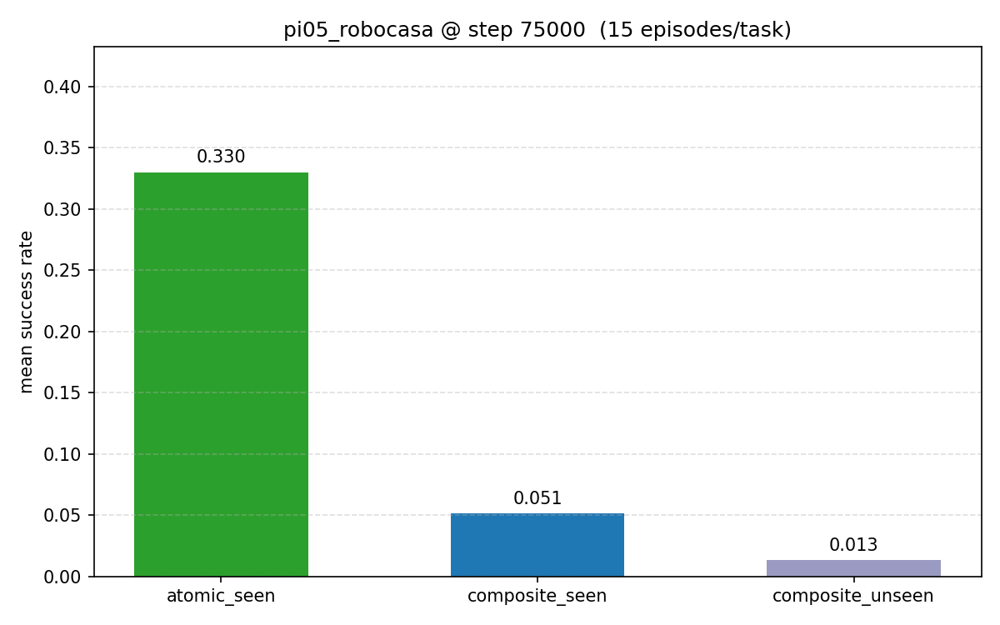
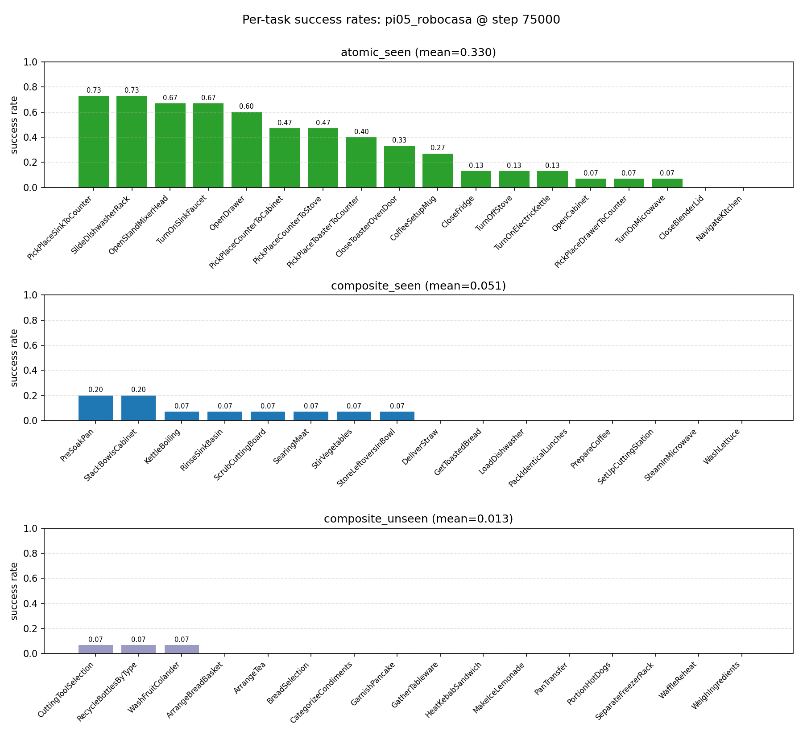

# Robocasa Client Example

[Robocasa](https://robocasa.ai/docs/build/html/index.html) has dependencies incompatible with the root `openpi` venv, so this directory is a **separate venv**. The sim (client, here) and the model (server, in the root venv or `groot_env/`) talk over WebSocket.

The client is **backend-agnostic** — `main.py` / `eval_all.py` can target either a **pi05 server** (`scripts/serve_policy.py`) or an **NVIDIA GR00T N1.5 server** ([`groot_env/serve.py`](../../groot_env/README.md)) with no client-side changes; just point `--host` / `--port` at whichever is running.

## Installation

Adapted from the [Robocasa setup guide](https://robocasa.ai/docs/build/html/introduction/installation.html):

```bash
cd examples/robocasa_env
uv sync
uv run python -m robocasa.scripts.setup_macros
uv run python -m robocasa.scripts.download_kitchen_assets   # ~10GB
```

## Serving

### pi05 (root venv)

Download + path surgery:

```bash
hf download robocasa/robocasa365_checkpoints \
    --include "pi05_pretrain_human300/multitask_learning/75000/*" --local-dir checkpoints
mkdir -p checkpoints/pi05_pretrain_human300/multitask_learning/75000/assets/robocasa
mv checkpoints/pi05_pretrain_human300/multitask_learning/75000/assets/norm_stats.json \
   checkpoints/pi05_pretrain_human300/multitask_learning/75000/assets/robocasa
```

Serve (add `--pytorch` to use the Torch backend; first run converts the JAX checkpoint to `model.safetensors` and caches it):

```bash
export CUDA_VISIBLE_DEVICES=0
uv run scripts/serve_policy.py policy:checkpoint \
    --policy.config=pi05_robocasa \
    --policy.dir=checkpoints/pi05_pretrain_human300/multitask_learning/75000
```

### GR00T N1.5 (groot_env venv)

N1.5 pins `torch==2.5.1`, so it lives in its own venv at [`groot_env/`](../../groot_env/README.md). Full setup is documented there; minimum to serve:

```bash
cd groot_env && GIT_LFS_SKIP_SMUDGE=1 uv sync
uv pip install --no-build-isolation flash-attn==2.7.1.post4
uv run hf download robocasa/robocasa365_checkpoints \
    --include "gr00t_n1-5/multitask_learning/checkpoint-120000/*" --local-dir ../checkpoints/groot_n15

export CUDA_VISIBLE_DEVICES=0
uv run python serve.py --port 8000     # defaults to the checkpoint path above
```

## Evaluation

Two entry points, identical regardless of backend:

1. **`main.py`** — one task (one `env_name`), current process.
2. **`eval_all.py`** — every task in a task set (`atomic_seen`, `composite_seen`, `composite_unseen`, `pretrain50`), one `main.py` subprocess per env via a `ThreadPoolExecutor`.

Both default to `--split pretrain`. RoboCasa can't share EGL contexts across threads in one process, so in-process parallelism isn't possible; `eval_all.py` gets around this by giving each task its own subprocess. Env stepping is ~400ms/step, so 5–10 workers gives a real wall-clock win. `--num_workers 1` runs sequentially with inline tracebacks.

```bash
cd examples/robocasa_env
MUJOCO_GL=egl uv run python main.py --env_name CloseBlenderLid
MUJOCO_GL=egl uv run python eval_all.py --task_set atomic_seen --num_episodes 15 --num_workers 5
```

Output layout (default `output/<task_set>-<split>/`, override with `--output_dir`):

```
<output_dir>/
├── results.json                        # per-task + mean success rate, written incrementally
├── parallel_logs/task_NN_<env>.log     # per-subprocess stdout/stderr
└── <env_name>/episode_NNN.mp4          # per-episode video (tiles agentview_left/right + eye_in_hand)
```

### Published results (pi05, 15 ep/task)

`pi05_pretrain_human300/multitask_learning/75000` on the `pretrain` split; raw numbers in [`figures/results_75000.json`](figures/results_75000.json). Robocasa's own numbers: [multitask_learning page](https://robocasa.ai/docs/build/html/benchmarking/multitask_learning.html#benchmark-results-and-checkpoints).




### Published results (GR00T N1.5)

https://robocasa.ai/docs/build/html/benchmarking/multitask_learning.html

### Camera payload (pi05 vs GR00T)

The client always emits three camera keys; each server reads what it needs:

| Key | pi05 | GR00T N1.5 |
|---|:-:|:-:|
| `observation/image` (agentview_left) | ✓ | ✓ |
| `observation/image2` (agentview_right) | ignored | ✓ (trained with it) |
| `observation/wrist_image` (eye_in_hand) | ✓ | ✓ |

Same payload, same client, either server.

## Activation Collection

For mech-interp work you can have the policy server save per-step intermediate
activations to disk while a robocasa rollout runs. This uses the same
"collection-mode" policy server as the libero example: it wraps the policy in
`CollectingPolicy` and writes the same on-disk format as
`examples/metaworld/main.py --collect` (metaworld's in-process collector).
Activations live entirely on the
**server's** filesystem — the robocasa client never touches them, so the
client and server can be on different machines.

### Download Pre-Collected Activations

Both activation datasets: 7 robocasa tasks × 15 episodes (`CloseFridge`, `CoffeeSetupMug`, `OpenDrawer`, `OpenStandMixerHead`, `PickPlaceCounterToCabinet`, `PickPlaceCounterToStove`, `TurnOnElectricKettle`).

| Backend | Activation Dataset | Source checkpoint |
|---|---|---|
| pi05 | [`ksb21st/robocasa-activations-75000`](https://huggingface.co/datasets/ksb21st/robocasa-activations-75000) | [`pi05_pretrain_human300/multitask_learning/75000`](https://huggingface.co/robocasa/robocasa365_checkpoints/tree/main/pi05_pretrain_human300/multitask_learning/75000) |
| GR00T N1.5 | [`brandonyang/groot_n15-robocasa-activations-v1-15env`](https://huggingface.co/datasets/brandonyang/groot_n15-robocasa-activations-v1-15env) | [`gr00t_n1-5/multitask_learning/checkpoint-120000`](https://huggingface.co/robocasa/robocasa365_checkpoints/tree/main/gr00t_n1-5/multitask_learning/checkpoint-120000) |

```bash
hf download ksb21st/robocasa-activations-75000 --repo-type dataset --local-dir pi05-robocasa-activations-75000
hf download brandonyang/groot_n15-robocasa-activations-v1-15env --repo-type dataset --local-dir groot_n15-robocasa-activations-v1-15env
```

### Collecting your own

The policy server can save per-step intermediate activations to disk during a rollout. Activations live on the **server's** filesystem (client and server can be on different hosts). The client side is identical for both backends — same `--collect` flag, same `CollectionSession` helper, same wire protocol (`__collect__` / `__finalize_episode__` magic keys); only the server command differs.

Client (either backend):

```bash
cd examples/robocasa_env
MUJOCO_GL=egl uv run python main.py --env_name CloseBlenderLid --collect
MUJOCO_GL=egl uv run python eval_all.py --task_set atomic_seen --collect --num_workers 5
```

Server — pick one:

```bash
# pi05 (root venv). --pytorch is required: infer_with_intermediates is Torch-only.
export CUDA_VISIBLE_DEVICES=0
uv run scripts/serve_policy.py --pytorch --collect_activations \
    --output-dir ./activations \
    policy:checkpoint --policy.config=pi05_robocasa \
    --policy.dir=checkpoints/pi05_pretrain_human300/multitask_learning/75000

# GR00T (groot_env venv). serve.py is PyTorch-only; no equivalent flag needed.
export CUDA_VISIBLE_DEVICES=0
cd groot_env && uv run python serve.py --port 8000 --collect-activations \
    --output-dir ../groot_n15-robocasa-activations-v1-15env
```

Output layout (either backend): `<output-dir>/<checkpoint_step>/<env_name>/episode_NNN_env_000/step_NNNN/`.

| File | pi05 | GR00T N1.5 (analog) |
|---|---|---|
| `denoising.npz` | ✓ | ✓ |
| `adarms_cond.npz` | ✓ | `backbone_cond.npz` (different shape — see [`groot_env/README.md`](../../groot_env/README.md)) |
| `suffix_residual.npz` | ✓ | `dit_hidden_states.npz` |
| `suffix_mlp_hidden.npz` | ✓ | `dit_mlp_hidden.npz` |
| `metadata.json` | ✓ | ✓ |

### Notes

- A collection-mode server **rejects** plain inference requests. Run a separate non-collection server on another port if you also want eval.
- Each `eval_all.py` subprocess creates its own `CollectionSession` keyed on `env_name`, so tasks write to disjoint dirs with no cross-process coordination. The server's asyncio dispatch already serializes inference; `CollectingPolicy`'s lock makes that invariant explicit.
- Client uses `env_name` as `task_name`; `task_id` is fixed at 0; `episode_id` cycles `0..num_episodes-1` per env.
- Full wire-level protocol spec: see `examples/libero_env/README.md` (**Protocol** section).

### Verifying collected activations

Env-var-driven pytest suite; skipped in CI when `ACTIVATIONS_DIR` is unset.

```bash
# GR00T
cd groot_env
ACTIVATIONS_DIR=../groot_n15-robocasa-activations-v1-15env/checkpoint-120000/OpenDrawer \
    uv run pytest tests/test_groot_activations.py -v

# pi05 (repo root)
ACTIVATIONS_DIR=./activations/75000/CloseBlenderLid \
    uv run pytest tests/test_activations.py -v
```
